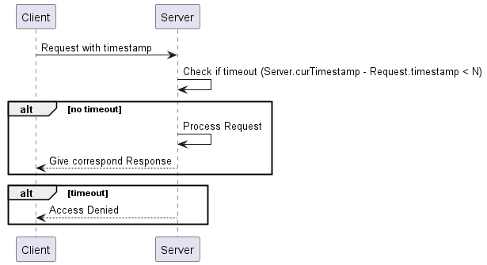
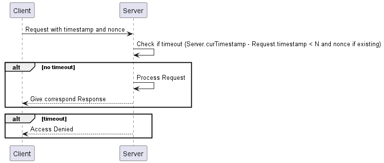
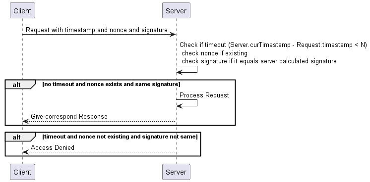

# 重放攻击（Replay Attacks）

## 什么是重放攻击？

重放攻击又称为重播攻击、回放攻击，这种攻击不会恶意或欺骗性地重复一个有效的请求。攻击者利用网络监听或者其他方式盗取 API 请求，进行一定的处理后，再把它重新发给服务器。

## 如何防止重放攻击？

1. 时间戳

在请求中加入时间戳和数字签名，时间戳表示请求发送时间，同时服务器假设请求达到服务器的时间不会超过 N 秒，那么在带有时间戳的请求到达服务器后，服务器首先需要验证时间戳，验证算法：服务器当前时间戳 - 请求时间戳 < N 秒则视为请求有效否则无效。

流程：



> 使用时间戳阻止重放攻击的问题在于：黑客捕获到请求后可以在 N 秒内重放。

2. 时间戳 + 随机数 Nonce

时间戳方案可以在 N 秒内进行重放，那么我们可以在请求中添加一个 Nonce，每次请求成功服务器保存当前成功请求的随机数 Nonce。

流程：



3. 签名

签名可以对身份进行认证和防止请求被更改，再结合时间戳和随机数 Nonce 可以防止重放攻击。

流程：



## 工程实践

1. 签名算法

可选 HmacSHA1、HmacSHA256 和 HmacSHA384 等

2. 待签名字段

* app key
* nonce
* timestamp
* business fields

3. 签名字段

signature

4. 实际举例

HTTP 请求一个开放 API，那么流程可以如下：

* 签发密钥
* 自定义协议头

| 协议头                    | 功能                                                                     |
|------------------------|------------------------------------------------------------------------|
| X-Ca-Key               | 客户端标识，用于查找客户端信息和客户端密钥                                                  |
| X-Ca-Nonce             | 随机数，可以为 UUID                                                           |
| X-Ca-Timestamp         | 毫秒级时间戳                                                                 |
| X-Ca-Signature-Method  | 签名算法，可以定义支持的签名算法，如：HmacSHA256 或 HmacSHA1                               |
| X-Ca-Signature-Headers | 参与签名的协议头，如：X-Ca-Key, X-Ca-Nonce, X-Ca-Signature-Method, X-Ca-Timestamp |
| X-Ca-Signature         | 客户端计算的签名                                                               |

* 计算签名

```java
Mac hmacSha256 = Mac.getInstance("HmacSHA256");
byte[] appSecretBytes = appSecret.getBytes(Charset.forName("UTF-8"));
hmacSha256.init(new SecretKeySpec(appSecretBytes, 0, appSecretBytes.length, "HmacSHA256"));
byte[] md5Result = hmacSha256.doFinal(stringToSign.getBytes(Charset.forName("UTF-8")));
String signature = Base64.encodeBase64String(md5Result);
```

* 传输签名

将自定义协议头传输给开放服务

## 参考文献

1. [Web 安全防范-防止重放攻击](https://segmentfault.com/a/1190000022713583)
2. [如何有效防止 API 的重放攻击？](https://help.aliyun.com/zh/api-gateway/support/how-to-prevent-replay-attacks)
3. [使用摘要签名认证方式调用 API](https://help.aliyun.com/zh/api-gateway/user-guide/use-digest-authentication-to-call-an-api)
